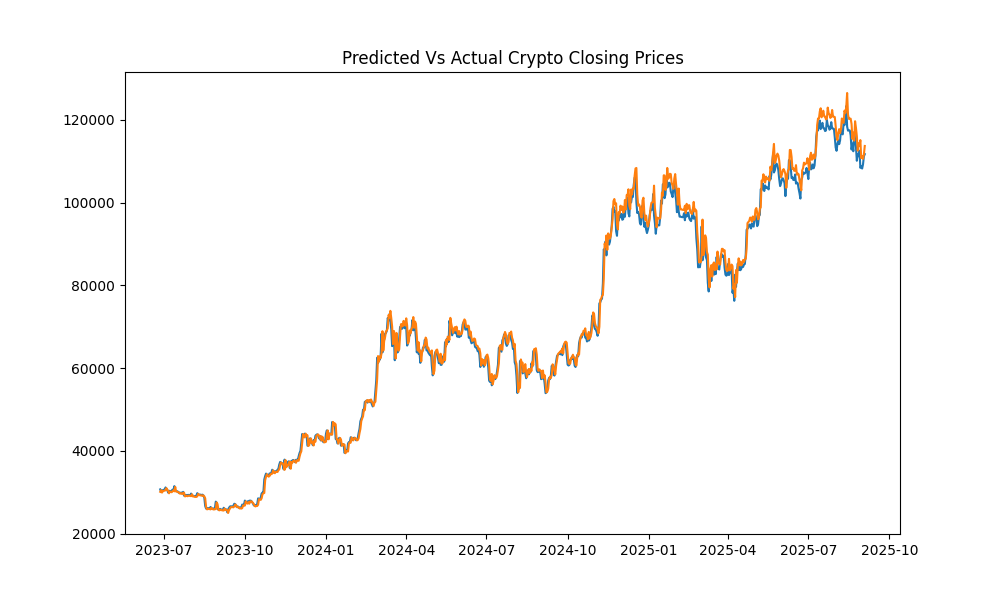

## Bitcoin LSTM Forecast


### Requirements
```Bash
pip install matplotlib seaborn pandas torch torchvision torchaudio numpy yfinance scikit-learn
```


```python
scaler = MinMaxScaler()

train_data = scaler.fit_transform(train_data)
test_data = scaler.transform(test_data)


def slider(dataframe,seq_length):
    X,y = [],[]
    for i in range(len(dataframe) - seq_length):
        Xi = dataframe[i:(seq_length + i)]
        yi = dataframe[(seq_length + i)]
        X.append(Xi)
        y.append(yi)
    return np.array(X),np.array(y)

seq_length = 1
X_train,y_train = slider(train_data,seq_length)
X_test,y_test = slider(test_data,seq_length)
```

### GRU
```python
class GRU(nn.Module):
    def __init__(self, input_size, hidden_size, num_layers, output_size):
        super(GRU, self).__init__()
        self.input_size = input_size
        self.hidden_size = hidden_size
        self.num_layers = num_layers
        self.output_size = output_size
        self.gru = nn.GRU(input_size, hidden_size, num_layers, batch_first=True)
        self.fc = nn.Linear(hidden_size, output_size)

    def forward(self, X):
        h0 = torch.zeros(self.input_size, X.size(0), self.hidden_size)
        out, _ = self.gru(X, h0)
        out = self.fc(out[:,-1,:])
        return out


input_size = 1
hidden_size = 256
num_layers = 1
output_size = 1
learning_rate= 0.001


model = GRU(input_size,hidden_size,num_layers,output_size)
optimizer = torch.optim.Adam(model.parameters(),lr=learning_rate)
loss_fn = nn.MSELoss()
epochs = 500
```

### After the usual steps ...




```text
Root Mean Squared Error: 2164.7517
R2-Score: 99.40%
         Date  Actual Price  Predicted Price
0  2023-06-27  30688.164062     30099.230469
1  2023-06-28  30086.246094     30518.269531
2  2023-06-29  30445.351562     29913.507812
3  2023-06-30  30477.251953     30274.271484
4  2023-07-01  30590.078125     30306.324219
5  2023-07-02  30620.769531     30419.701172
6  2023-07-03  31156.441406     30450.542969
7  2023-07-04  30777.583984     30988.994141
8  2023-07-05  30514.167969     30608.140625
9  2023-07-06  29909.337891     30343.416016
10 2023-07-07  30342.265625     29735.820312
11 2023-07-08  30292.541016     30170.697266
12 2023-07-09  30171.234375     30120.740234
13 2023-07-10  30414.470703     29998.876953
14 2023-07-11  30620.951172     30243.244141
15 2023-07-12  30391.646484     30450.724609
16 2023-07-13  31476.050781     30220.308594
17 2023-07-14  30334.070312     31310.380859
18 2023-07-15  30295.806641     30162.462891
19 2023-07-16  30249.132812     30124.021484
          Date   Actual Price  Predicted Price
780 2025-08-15  117398.351562    121242.414062
781 2025-08-16  117491.351562    120228.843750
782 2025-08-17  117453.054688    120326.898438
783 2025-08-18  116252.304688    120286.523438
784 2025-08-19  112831.171875    119020.679688
785 2025-08-20  114274.734375    115415.984375
786 2025-08-21  112419.031250    116936.648438
787 2025-08-22  116874.085938    114981.921875
788 2025-08-23  115374.328125    119676.125000
789 2025-08-24  113458.421875    118095.312500
790 2025-08-25  110124.343750    116076.664062
791 2025-08-26  111802.656250    112566.093750
792 2025-08-27  111222.054688    114332.875000
793 2025-08-28  112544.796875    113721.593750
794 2025-08-29  108410.828125    115114.375000
795 2025-08-30  108808.062500    110763.078125
796 2025-08-31  108236.710938    111180.984375
797 2025-09-01  109250.593750    110579.914062
798 2025-09-02  111200.585938    111646.593750
799 2025-09-03  111723.210938    113698.976562
```

### Results from Traditional ML Models(Random Forest Again)
```text
R2 Score from Best Model: 99.91%
RMSE from best model: 821.75
Predicted Vs Actual Closing Prices

             Actual      Predicted
12       375.467010     385.818549
18       320.510010     331.839501
23       361.562012     363.818813
25       378.549011     384.169594
30       383.757996     386.385576
...             ...            ...
3935  106960.000000  107227.341172
3946  108299.851562  109363.163047
3947  108950.273438  112013.057188
3954  117777.187500  119006.191094
3958  117939.976562  117918.295156

[793 rows x 2 columns]
        Actual   Predicted
12  375.467010  385.818549
18  320.510010  331.839501
23  361.562012  363.818813
25  378.549011  384.169594
30  383.757996  386.385576
33  382.845001  386.585391
44  338.321014  332.295724
52  345.488007  348.697588
56  423.561005  380.648732
59  376.132996  401.649461
60  387.881989  393.736360
62  375.197998  378.135454
65  350.847992  359.041870
81  375.095001  373.665523
82  361.908997  358.713087
85  350.506012  348.804312
90  327.062012  342.562167
91  319.776001  320.902516
95  320.842987  328.944131
98  322.533997  329.958773
             Actual      Predicted
3857   82573.953125   77414.991406
3866   84450.804688   84895.117109
3871   93699.109375   92628.657734
3873   94720.500000   94011.217813
3876   94978.750000   94010.929609
3886  103241.460938   98586.872578
3892  103539.414062  103836.664141
3894  103489.289062  103576.379062
3900  111673.281250  108659.400000
3907  105641.757812  107182.295938
3908  103998.570312  105933.980156
3911  105881.531250  105218.643828
3912  105432.468750  104079.371484
3915  104390.343750  103196.648828
3929  103309.601562  103072.608672
3935  106960.000000  107227.341172
3946  108299.851562  109363.163047
3947  108950.273438  112013.057188
3954  117777.187500  119006.191094
3958  117939.976562  117918.295156
```


