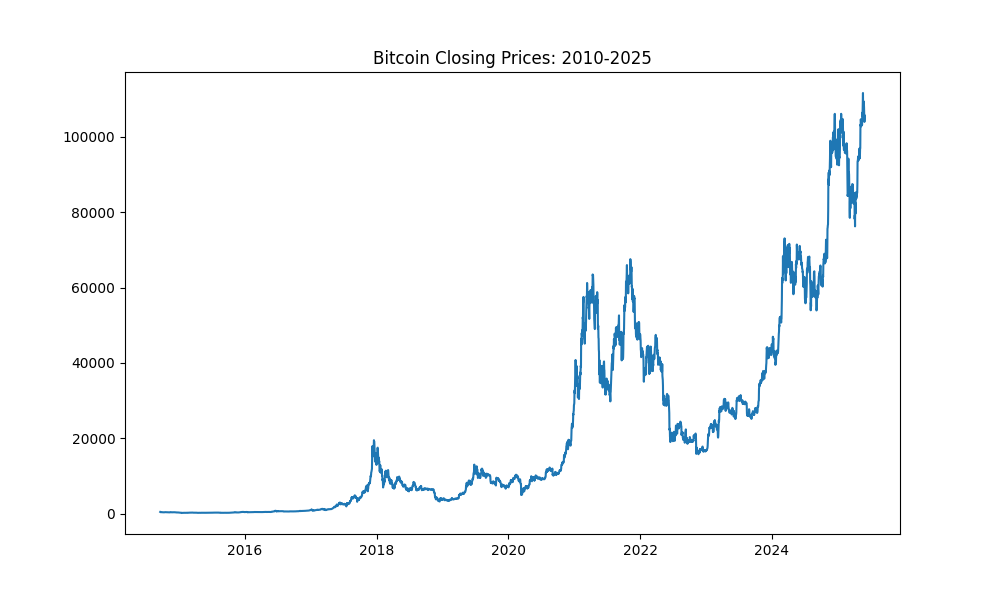
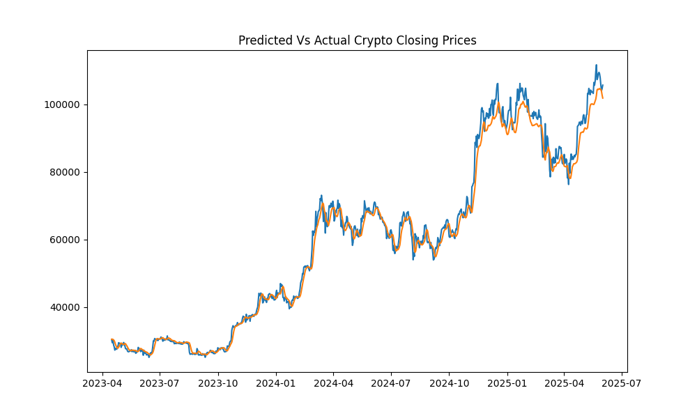

## Bitcoin LSTM Forecast

This minor forecast, tries to predict the prices of BTC-USD from the years 2010-2025(yesterday). A LSTM is used through pytorch. Yet, recurrence and the exploding gradient problem persists. However, the Recurrent Neural Network does help more with sequential data that does not need ATTENTION and is indeed continuous.

### Requirements
```Bash
pip install matplotlib seaborn pandas torch torchvision torchaudio numpy yfinance scikit-learn
```
### Preprocessing the data for the LSTM

```python
bitcoin = yf.download("BTC-USD",start="2010-05-17",end="2025-07-23")['Close']
bitcoin = bitcoin.shift(1)
bitcoin.dropna(inplace=True)
bitcoin = bitcoin.reset_index()

training = bitcoin.iloc[:,1:2].values

train_size = int(len(training)* 0.80)

train_data = training[:train_size]
test_data = training[train_size:]


```


The train test split is like any train test split, but it depends on the range of years from which the historical data draws from. It differs compared to say the usual sklearn train_test split. No, it is not like that, the test data, could be more than the training data if that old “tried and true approach” is taken. You have to feel the data to determine the proper train test split. It is really a “feel thing” when it comes to picking the right train/test size.

### The Slider and the Sequence Length
Do not think about the sequence length too long. Do not be mathematically pedantic. You just want to find sequence that minimize the loss. It is very rarely over 10 sequences. Do not think about that much, it will waste time.

```python
def slider(dataframe,seq_length):
    X,y = [],[]
    for i in range(len(dataframe) - seq_length):
        Xi = dataframe[i:(seq_length + i)]
        yi = dataframe[(seq_length + i)]
        X.append(Xi)
        y.append(yi)
    return np.array(X),np.array(y)

seq_length = 12
X_train,y_train = slider(train_data,seq_length)
X_test,y_test = slider(test_data,seq_length)
```

### The GRU nn
```python
class GRU(nn.Module):
    def __init__(self, input_size, hidden_size, num_layers, output_size):
        super(GRU, self).__init__()
        self.input_size = input_size
        self.hidden_size = hidden_size
        self.num_layers = num_layers
        self.output_size = output_size
        self.gru = nn.GRU(input_size, hidden_size, num_layers, batch_first=True)
        self.fc = nn.Linear(hidden_size, output_size)

    def forward(self, X):
        h0 = torch.zeros(self.input_size, X.size(0), self.hidden_size)
        out, _ = self.gru(X, h0)
        out = self.fc(out[:,-1,:])
        return out


input_size = 1
hidden_size = 256
num_layers = 1
output_size = 1


model = GRU(input_size,hidden_size,num_layers,output_size)
optimizer = torch.optim.Adam(model.parameters(),lr=0.001)
loss_fn = nn.MSELoss()
epochs = 500

for epoch in range(epochs):
    y_pred = model(X_train)
    loss = loss_fn(y_pred.float(),y_train)
    optimizer.zero_grad()
    loss.backward()
    optimizer.step()
    if epoch % 1 != 0:
        continue
    model.eval()
    with torch.no_grad():
        y_pred = model(X_train)
        train_rsme = np.sqrt(loss_fn(y_pred,y_train))
        y_pred_test =  model(X_test)
        test_rsme = np.sqrt(loss_fn(y_pred_test,y_test))
        print(f'Epoch: {epoch}; train_RSEM: {train_rsme:.4}; Test RSME: {test_rsme:.4}')
```

### After the usual steps ...




```text
Root Mean Squared Error: 0.0353
R2-Score: 99.23%
         Date  Actual Price  Predicted Price
0  2023-06-07  26346.000000     26834.541016
1  2023-06-08  26508.216797     26736.240234
2  2023-06-09  26480.375000     26673.404297
3  2023-06-10  25851.240234     26633.664062
4  2023-06-11  25940.167969     26449.093750
5  2023-06-12  25902.501953     26269.662109
6  2023-06-13  25918.728516     26131.734375
7  2023-06-14  25124.677734     26055.423828
8  2023-06-15  25576.394531     25820.111328
9  2023-06-16  26327.464844     25689.613281
10 2023-06-17  26510.677734     25839.037109
11 2023-06-18  26336.212891     26124.523438
12 2023-06-19  26851.031250     26349.806641
13 2023-06-20  28327.488281     26614.822266
14 2023-06-21  30027.296875     27216.501953
15 2023-06-22  29912.281250     28264.871094
16 2023-06-23  30695.470703     29211.308594
17 2023-06-24  30548.697266     30057.087891
18 2023-06-25  30480.261719     30587.839844
19 2023-06-26  30271.132812     30813.541016
          Date   Actual Price  Predicted Price
762 2025-07-08  108950.273438    106443.671875
763 2025-07-09  111326.546875    106460.039062
764 2025-07-10  115987.203125    107419.359375
765 2025-07-11  117516.992188    110217.648438
766 2025-07-12  117435.218750    113526.664062
767 2025-07-13  119116.117188    115512.179688
768 2025-07-14  119849.695312    116411.562500
769 2025-07-15  117777.187500    116882.179688
770 2025-07-16  118738.507812    116360.953125
771 2025-07-17  119289.843750    115725.257812
772 2025-07-18  118003.218750    115715.437500
773 2025-07-19  117939.976562    115637.804688
774 2025-07-20  117300.781250    115339.781250
775 2025-07-21  117439.531250    114873.343750
776 2025-07-22  119995.414062    114561.851562
777 2025-07-23  118754.960938    115391.632812
778 2025-07-24  118368.000000    116232.531250
779 2025-07-25  117635.875000    116303.609375
780 2025-07-26  117947.367188    115655.562500
781 2025-07-27  119448.484375    115073.781250
```

### Results from Traditional ML Models(Random Forest Again)
```text
R2 Score from Best Model: 99.90%
RMSE from best model: 879.48

Predicted Vs Actual Closing Prices

             Actual      Predicted
5        402.152008     405.497525
6        435.790985     417.150572
8        411.574005     416.855168
14       383.614990     380.556992
15       375.071991     369.760000
V

[793 rows x 2 columns]
         Actual   Predicted
5    402.152008  405.497525
6    435.790985  417.150572
8    411.574005  416.855168
14   383.614990  380.556992
15   375.071991  369.760000
16   359.511993  330.357371
26   390.414001  392.379611
38   347.270996  355.535376
41   357.618011  348.511480
47   327.553986  328.290571
49   339.485992  336.140366
59   376.132996  397.465782
61   387.407990  385.797690
62   375.197998  376.743733
67   367.572998  359.569067
88   351.631989  346.263115
107  315.032013  291.817039
109  264.195007  281.026550
136  217.464005  229.552652
137  226.972000  234.683614
             Actual      Predicted
3864   84033.867188   84503.557344
3867   85063.414062   84807.409141
3872   93943.796875   94274.320000
3876   94978.750000   94232.826484
3885   97032.320312   97606.868516
3888  104696.328125  102342.183594
3889  104106.359375  102853.855156
3890  102812.953125  103381.798437
3891  104169.812500  103468.973437
3893  103744.640625  103579.986094
3896  106446.007812  103971.363203
3900  111673.281250  108896.113281
3903  109035.390625  108858.963906
3924  105552.023438  105865.193203
3930  102257.406250  102082.349531
3936  107088.429688  107152.149063
3945  109232.070312  108420.463281
3949  115987.203125  115587.452813
3952  119116.117188  117891.949844
3960  117439.539062  117549.783672
```


