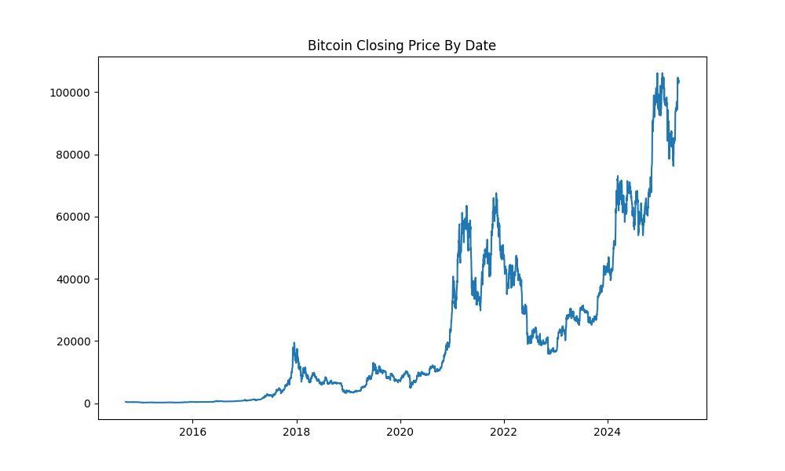
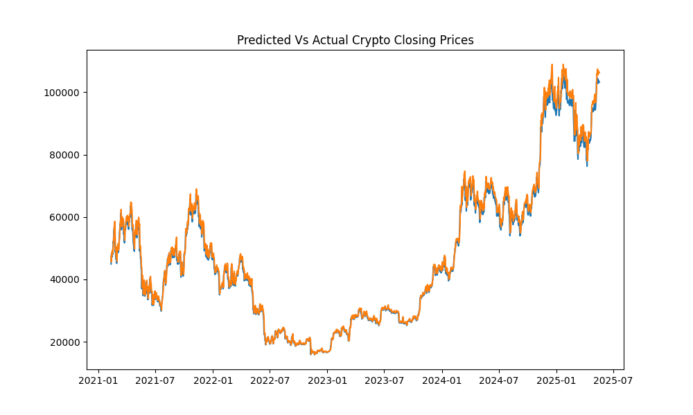

## Bitcoin LSTM Forecast

This minor forecast, tries to predict the prices of BTC-USD from the years 2010-2025(yesterday). A LSTM is used through pytorch. Yet, recurrence and the exploding gradient problem persists. However, the Recurrent Neural Network does help more with sequential data that does not need ATTENTION and is indeed continuous.

### Requirements
```Bash
pip install matplotlib seaborn pandas torch torchvision torchaudio numpy yfinance scikit-learn
```
### Preprocessing the data for the LSTM

```python
bitcoin = yf.download("BTC-USD",start="2010-05-18",end="2025-05-18")['Close']

bitcoin = bitcoin.reset_index()

training = bitcoin.iloc[:,1:2].values

train_size = int(len(training)* .60)

train_data = training[:train_size]
test_data = training[train_size:]
```


The train test split is like any train test split, but it depends on the range of years from which the historical data draws from. It differs compared to say the usual sklearn train_test split. No, it is not like that, the test data, could be more than the training data if that old “tried and true approach” is taken. You have to feel the data to determine the proper train test split. It is really a “feel thing” when it comes to picking the right train/test size.

### The Slider and the sequence length
Do not think about the sequence length too long. Do not be mathematically pedantic. You just want to find sequence that minimize the loss. It is very rarely over 10 sequences. Do not think about that much, it will waste time.

```python
def slider(df,seq_length):
    X,y = [],[]
    for i in range(len(df) - seq_length):
        X_ = df[i:(seq_length + i)]
        y_ = df[(seq_length + i)]
        X.append(X_)
        y.append(y_)
    return np.array(X),np.array(y)

seq_length = 1
X_train,y_train = slider(train_data,seq_length)
X_test,y_test = slider(test_data,seq_length)
```
I decided to not scale the feature range from the range(0,1). I did not think it was necceassary for the minmax scaler

### The LSTM
I used the tradional-vanilla lstm. No add on's, no GRU's, none. I feel when the target is continous, one should make it work, so I selected 1000 epochs to go with the sequence length of 1.
```python
class LSTM(nn.Module):
    def __init__(self,input_size,hidden_size,num_layers,output_size):
        super(LSTM,self).__init__()
        self.input_size = input_size
        self.hidden_size = hidden_size
        self.num_layers = num_layers
        self.output_size = output_size
        self.lstm = nn.LSTM(input_size,hidden_size,num_layers,batch_first=True)
        
        self.fc = nn.Linear(hidden_size,output_size)
        
    def forward(self,X):
        h0 = torch.zeros(self.num_layers,X.size(0),self.hidden_size)
        c0 = torch.zeros(self.num_layers,X.size(0),self.hidden_size)
        out,_ = self.lstm(X,(h0,c0))
        out = self.fc(out[:,-1,:])
        return out


model = LSTM(input_size=1,hidden_size=512,num_layers=1,output_size=1)
optimizer = torch.optim.Adam(model.parameters(),lr=0.001)
loss_fn = nn.MSELoss(reduction="sum")
epochs = 1000
```

### After the usual steps ...




