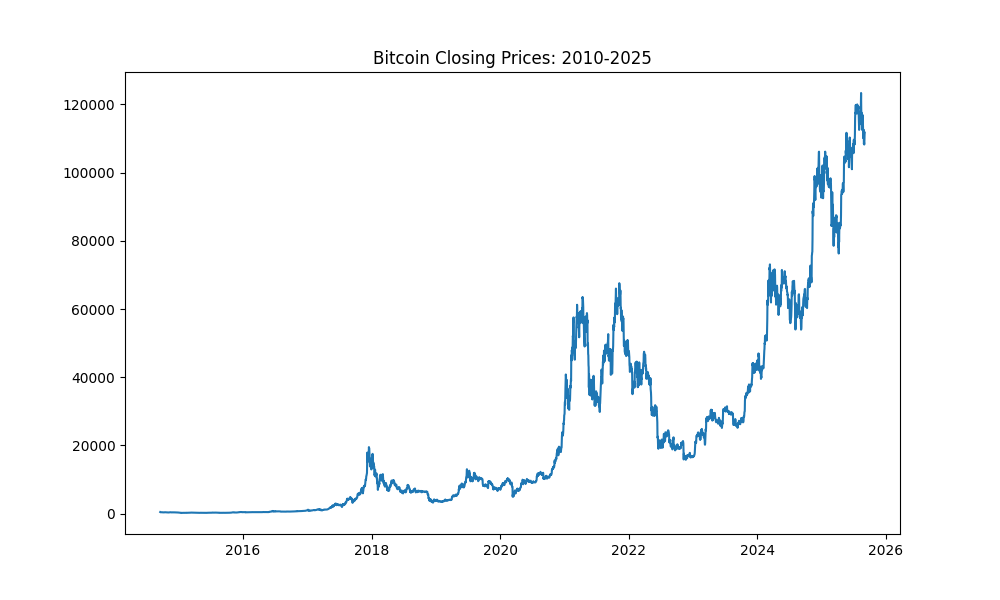

## Bitcoin LSTM Forecast


### Requirements
```Bash
pip install matplotlib seaborn pandas torch torchvision torchaudio numpy yfinance scikit-learn
```




ime.

```python
def slider(dataframe,seq_length):
    X,y = [],[]
    for i in range(len(dataframe) - seq_length):
        Xi = dataframe[i:(seq_length + i)]
        yi = dataframe[(seq_length + i)]
        X.append(Xi)
        y.append(yi)
    return np.array(X),np.array(y)

seq_length = 12
X_train,y_train = slider(train_data,seq_length)
X_test,y_test = slider(test_data,seq_length)
```

### GRU
```python
class GRU(nn.Module):
    def __init__(self, input_size, hidden_size, num_layers, output_size):
        super(GRU, self).__init__()
        self.input_size = input_size
        self.hidden_size = hidden_size
        self.num_layers = num_layers
        self.output_size = output_size
        self.gru = nn.GRU(input_size, hidden_size, num_layers, batch_first=True)
        self.fc = nn.Linear(hidden_size, output_size)

    def forward(self, X):
        h0 = torch.zeros(self.input_size, X.size(0), self.hidden_size)
        out, _ = self.gru(X, h0)
        out = self.fc(out[:,-1,:])
        return out


input_size = 1
hidden_size = 256
num_layers = 1
output_size = 1
learning_rate= 0.001


model = GRU(input_size,hidden_size,num_layers,output_size)
optimizer = torch.optim.Adam(model.parameters(),lr=learning_rate)
loss_fn = nn.MSELoss()
epochs = 500
```

### After the usual steps ...


```text
Root Mean Squared Error: 0.0286
R2-Score: 99.53%
         Date  Actual Price  Predicted Price
0  2023-06-27  30688.164062     30153.136719
1  2023-06-28  30086.246094     30571.421875
2  2023-06-29  30445.351562     29967.730469
3  2023-06-30  30477.251953     30327.867188
4  2023-07-01  30590.078125     30359.863281
5  2023-07-02  30620.769531     30473.033203
6  2023-07-03  31156.441406     30503.820312
7  2023-07-04  30777.583984     31041.232422
8  2023-07-05  30514.167969     30661.121094
9  2023-07-06  29909.337891     30396.888672
10 2023-07-07  30342.265625     29790.343750
11 2023-07-08  30292.541016     30224.478516
12 2023-07-09  30171.234375     30174.609375
13 2023-07-10  30414.470703     30052.953125
14 2023-07-11  30620.951172     30296.896484
15 2023-07-12  30391.646484     30503.998047
16 2023-07-13  31476.050781     30274.003906
17 2023-07-14  30334.070312     31361.960938
18 2023-07-15  30295.806641     30216.255859
19 2023-07-16  30249.132812     30177.882812
          Date   Actual Price  Predicted Price
781 2025-08-16  117491.351562    119140.273438
782 2025-08-17  117453.054688    119236.218750
783 2025-08-18  116252.304688    119196.695312
784 2025-08-19  112831.171875    117957.890625
785 2025-08-20  114274.734375    114428.789062
786 2025-08-21  112419.031250    115917.804688
787 2025-08-22  116874.085938    114003.710938
788 2025-08-23  115374.328125    118599.359375
789 2025-08-24  113458.421875    117052.117188
790 2025-08-25  110124.343750    115075.773438
791 2025-08-26  111802.656250    111637.242188
792 2025-08-27  111222.054688    113367.992188
793 2025-08-28  112544.796875    112769.226562
794 2025-08-29  108410.828125    114133.429688
795 2025-08-30  108808.062500    109870.453125
796 2025-08-31  108236.710938    110280.007812
797 2025-09-01  109250.593750    109690.929688
798 2025-09-02  111200.585938    110736.273438
799 2025-09-03  111723.210938    112747.085938
800 2025-09-04  110723.593750    113286.070312
```

### Results from Traditional ML Models(Random Forest Again)
```text
Root Mean-Squared Error: 872.5
R2 Score: 99.90%
Mean Absolute Percentage Error: 0.0213
Predicted Vs Actual Prices

         Actual   Predicted
0    457.334015  419.248171
2    394.795990  419.248171
7    423.204987  424.807103
18   320.510010  332.538331
22   365.026001  349.266836
23   361.562012  363.885430
26   390.414001  384.859965
28   394.773010  394.723366
39   354.704010  349.948862
44   338.321014  338.516214
46   325.891998  327.123691
48   330.492004  331.052089
55   367.695007  385.153868
61   387.407990  378.935325
76   381.315002  376.089645
79   376.854004  371.348394
84   346.364990  353.390977
96   331.885986  330.990951
98   322.533997  323.226966
110  274.473999  272.801914
             Actual      Predicted
3824   86742.671875   86626.873516
3828   82862.210938   82416.177422
3838   84043.242188   84508.936016
3851   83102.828125   82922.329219
3864   84033.867188   84055.197969
3868   85174.304688   87115.756172
3875   93754.843750   94607.878984
3876   94978.750000   94360.255625
3890  102812.953125  104136.108203
3901  107287.796875  110723.556328
3902  107791.156250  109593.451016
3905  108994.640625  108586.045625
3913  104731.984375  105232.480156
3914  101575.953125  104887.134844
3917  105793.648438  106483.084062
3919  110257.234375  109083.710938
3922  106090.968750  105994.270781
3949  115987.203125  112727.624688
3953  119849.703125  118226.965156
3958  117939.976562  117914.973359
```


